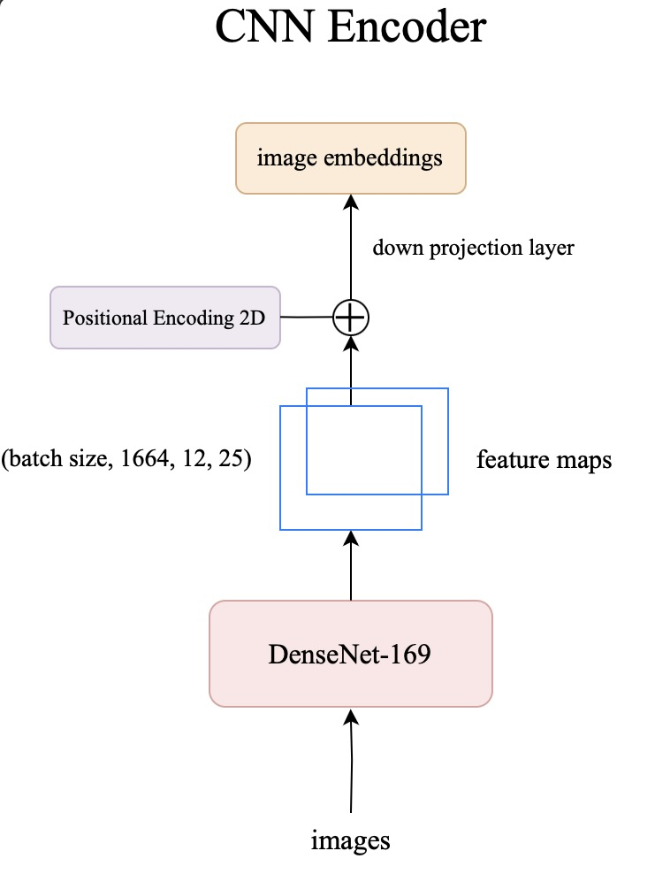
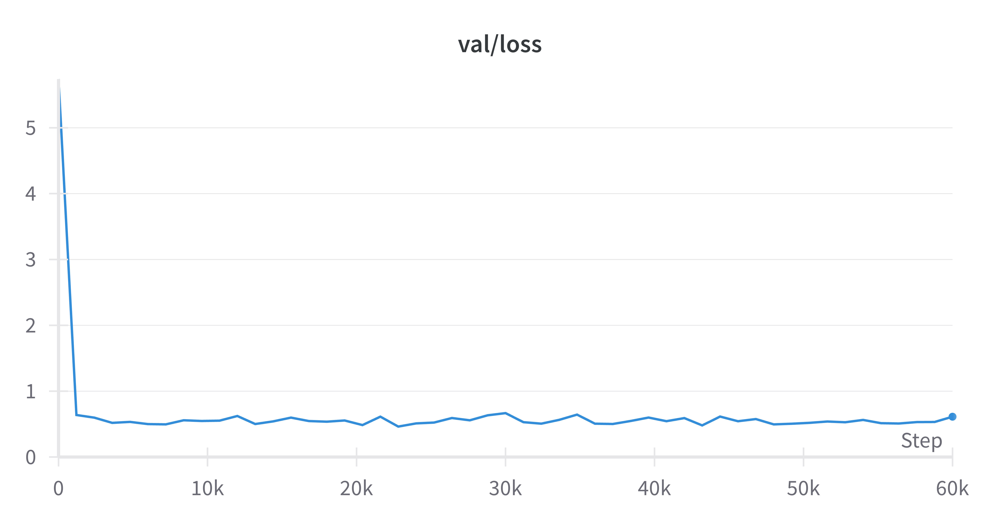
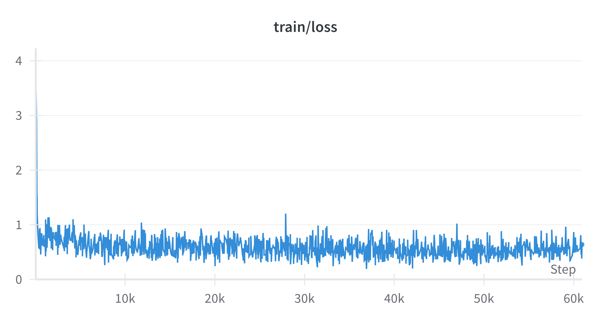

# DenseTeX

DenseTeX is an Image-to-LaTeX model designed to convert mathematical equations from images into LaTeX code. By combining a powerful CNN encoder based on DenseNet-169 with a GPT-style decoder, our model achieves reasonable accuracy in transcribing complex mathematical notation.

## model architecture

### Encoder

- **Input** : Images of mathematical equations
- **Base Model** : DenseNet-169
- **Positonal Encoding** : 
  - 2D Positional Encoding is added to the feature maps
  - Down projection layer to create image embeddings
- **Output** : Image embeddings (shape: [batch_size, 300, 768])

#### 2D Positional Encoding

To preserve the spatial relationships in mathematical, we implement a 2D positional encoding technique adapted from the Transformer model:

$PE(x, y, 2i) = \sin(x/10000^{4i/D}) $

$PE(x, y, 2i + 1) = \cos(x/10000^{4i/D}) $

$PE(x, y, 2j + D/2) = \sin(y/10000^{4j/D}) $

$PE(x, y, 2j + 1 + D/2) = \cos(y/10000^{4j/D})$

where :
- $x$ and $y$ specify the horizontal and vertical positions
- $i, j ∈ [0, d/4)$ specify the dimension
- $d$ is the model dimension

These positional encodings are added to the feature maps, allowing the model to retain crucial spatial information about the relative positions of mathematical symbols in both horizontal and vertical directions.

### Decoder
- **Input**: Image embeddings from the CNN Encoder
- **Model**: a GPT-2 based transformer with cross-attention to image embeddings
- **Output**: LaTeX tokens representing the equation in the input image

## Benchmarks
here are the benchmarks from the model training. We trained on 4xA6000s for ~10 hours.

## Data

we used the [UniMER-1M](https://huggingface.co/datasets/wanderkid/UniMER_Dataset) dataset for training and the `spe` & `cpe` samples for validation.

## acknowledgments

huge thanks to Karpathy sensei for [nanoGPT](https://github.com/karpathy/nanoGPT) which inspired our transformer decoder <3
